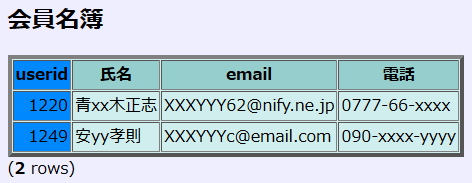
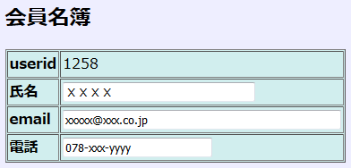

[[Prev](./usage04-j.md)] [[Menu](./readme.md)] [[Next](./usage06-j.md)]

* * *

# SQLの実行オプション

## オプションの指定方法<a id="OPTION" name="OPTION">&nbsp;</a>

オプションには、set文を使用した**定常的なオプション**と、exec_sqlコマンドを使用した**一時的なオプション**の２種類があります。定常的なオプションは、それが変更されるまで、実行される全てのSQLに対して有効です。一時的なオプションは、exec_sqlコマンドで指定されたSQLのみ有効になります。  

## set文による定常的なオプション<a id="SETOPTION" name="SETOPTION">&nbsp;</a>

定常的なオプションは次のように指定します。但し大文字小文字の区別はありません。  

**set EXEC_SQL_OPTION DEFAULT;**  
**set EXEC_SQL_OPTION CGI;**  
**set option_name[=value];**  

### (1) DEFAULT
'set EXEC_SQL_OPTION DEFAULT;'は、全てのオプションをデフォルトに戻します。  

### (2) CGI
'set EXEC_SQL_OPTION CGI;'は、シェルスクリプトをCGIモードにします。  

### (3) その他のオプション
その他のオプションでは、「ON（または TRUE)」、「OFF（または FALSE)」もしくは「オプションの値」をセットします。  
尚、ON/OFFの省略した場合は ON がセットされたことになります。例えば、set OPTION_ECHO; は set OPTION_ECHO=ON; と同じです。  

例)  

    set OPTION_ECHO; または set OPTION_ECHO=ON; または set OPTION_ECHO=TRUE;  
    set OPTION_QUIET=OFF; または set OPTION_QUIET=FALSE;  
    set OPTION_SEPARATOR=',';  
    set OPTION_NULLSTRING="*N*";  

|option_name|内容|DEFAULT value|
----|----|----
OPTION_ECHO|バックエンドに送信されるクエリを表示|OFF
OPTION_QUIET|エラーメッセージを表示しない|OFF(表示する)
OPTION_HEADER|表のヘッダー部を表示|ON
OPTION_BOTTOM|表の最下段(行数)を表示|ON
OPTION_ALIGNMENT|表の列の並びを揃える。CSV形式で出力する場合は OFF にする。OPTION_SEPARATORを参照。|ON
OPTION_FRAME|表の外側の罫線を表示|OFF
OPTION_EXPANDED|検索結果の出力を拡張(expanded)表示形式に切り替える|OFF
OPTION_SEPARATOR|表の区切りの罫線文字を指定|｜
OPTION_NULLSTRING  OPTION_ZEROSTRING|検索結果の値が NULL もしくは all bit off の文字を指定|
OPTION_CAPTION|表のタイトル文字列を指定|
OPTION_HTML|HTML出力を行う  set EXEC_SQL_OPTION CGI; を実行すると自動的に HTML出力モード(set OPTION_HTML=ON;)になる|OFF
OPTION_TABLETAG|HTMLのTABLEタグのオプションを指定|
OPTION_HEADERTR|TABLEヘッダーのTRタグを指定（主にヘッダーの１行全列の背景色を変更する場合に使用)|
OPTION_HEADERTH|TABLEヘッダーのTHタグを、各列の数だけカンマ区切りで指定（列ごとの長さ色を変える場合などに使用）  OPTION_HEADERTHで指定したタグ数が、検索結果の列数に満たないときは、残りの列は、&lt;TH&gt;で満たされる。|
OPTION_BODYTAG|TABLEボディのTDタグを、各列の数だけカンマ区切りで指定(列ごとの長さ色を変える場合に使用） OPTION_BODYTAGで指定したタグ数が、検索結果の列数に満たないときは、残りの列は、&lt;TD&gt;で満たされる。|
OPTION_INPUTTAG|更新可能なフィールド形式に変更して検索結果を表示  (下記の例2を参照）|OFF
OPTION_INPUTSIZE|OPTION_INPUTTAGがONの場合、各列の長さをカンマ区切りで指定  長さを0にすると自動決定し、長さを -1 にすると入力不可になる。  OPTION_INPUTSIZEで指定した長さの値の数が、検索結果の列数に満たないときは、残りは全て自動決定になる。|

OPTION_HEADER の例１)  

    set option_header=on;  
    select * from test;  

    code|name   |addr
    ----+-------+-----
     101|tanaka |tokyo
     111|yoshida|fukui
    (2 rows)

OPTION_HEADER の例２)  

    set option_header=off;
    select * from test;

     101|tanaka |tokyo
     111|yoshida|fukui
    (2 rows)

OPTION_BOTTOM の例)  

    set option_bottom=off;
    select * from test;

    code|name   |addr
    ----+-------+-----
     101|tanaka |tokyo
     111|yoshida|fukui

OPTION_FRAME の例)  

    set option_frame=on;
    select * from test;

    +------+---------+-------+
    | code | name    | addr  |
    +------+---------+-------+
    |  101 | tanaka  | tokyo |
    |  111 | yoshida | fukui |
    +------+---------+-------+
    (2 rows)

OPTION_EXPANDED の例)

    set option_expan
    ded=on;
    select * from test;

    ----- RECORD 0 -----
    code｜101   
    name｜tanaka
    addr｜tokyo
    ----- RECORD 1 -----
    code｜111
    name｜yoshida
    addr｜fukui

OPTION_SEPARATOR の例１)

    set option_expanded=on;
    set option_separator='：'; 
    select * from test;

    ----- RECORD 0 -----
    code:101
    name:tanaka
    addr:tokyo
    ----- RECORD 1 -----
    code:111
    name:yoshida
    addr:fukui

OPTION_SEPARATOR の例２)

    set option_header=off;
    set option_bottom=off;
    set option_expanded=off;
    set option_alignment=off;
    set option_separator=',';
    select * from test;

    [CSV形式の出力]
    101,tanaka,tokyo
    111,yoshida,fukui

OPTION_NULLSTRING と OPTION_ZEROSTRING の例１)

    set option_nullstring='N';
    set option_zerostring='0';
    select * from test;

    code|name   |addr
    ----+-------+-----
     101|tanaka |tokyo
     110|N     |0
     210|sakaida|osaka

OPTION_NULLSTRING と OPTION_ZEROSTRING の例２)

    set option_nullstring='';
    set option_zerostring=''
    select * from test;

    code|name   |addr
    ----+-------+-----
     101|tanaka |tokyo
     110|       |  
     210|sakaida|osaka

OPTION_TABLETAG の例)

    set OPTION_TABLETAG='
    <table bgcolor=#eeeeee%>';

OPTION_HEADERTR の例)

    set OPTION_HEADERTR='
    <TR BGCOLOR=#92CDCD>';

OPTION_HEADERTH の例)

    set OPTION_HEADERTH='
    <TH bgcolor=#0088FF>,
    <TH nowrap>,
    <TH>';

OPTION_BODYTAG の例)

    set OPTION_BODYTAG='
    <TD bgcolor=#0088FF>,
    <TD nowrap>,
    <TD>';

OPTION_INPUTSIZE の例)

    set option_inputsize='-1,32,48,0';

（例1)  

    set OPTION_CAPTION='
<B>会員名簿</B>
';set OPTION_TABLETAG='<table bgcolor=#D1EEEE border=4 cellspacing=0 cellpadding=2>';  
    set OPTION_HEADERTR='<tr bgcolor=#96CDCD>';  
    set OPTION_HEADERTH='<TH bgcolor=#0088FF nowrap>,<TH nowrap>,<TH nowrap>';  
    set OPTION_BODYTAG='<TD bgcolor=#0088FF nowrap>,<TD nowrap>,<TD nowrap>';  
    select * from member where userid>0 order by userid;  

**出力例**  

  

(例2)  

    set OPTION_CAPTION='
<B>会員名簿</B>
';  
    set OPTION_TABLETAG='<table border=1 bgcolor=#D1EEEE cellspacing=1 cellpadding=2>';  
    set OPTION_HEADER=OFF;  
    set OPTION_BOTTOM=OFF;  
    set OPTION_EXPANDED=ON;  
    set OPTION_INPUTTAG=ON;  
    set OPTION_INPUTSIZE='-1, 32, 48, 0';  
    select * from member where userid=1258;  

**出力例**  

  

## exec_sqlコマンドによる一時的なオプション<a id="TEMPOPTION" name="TEMPOPTION">&nbsp;</a>

一時的にオプションを指定してSQLを実行するには、exec_sqlコマンドを使用します。  

**exec_sql オプション "SQL"**  

|オプション|内容|set文のオプションとの比較|
|---------|----|-----------------------|
|-e|バックエンドに送信されるクエリを表示|set OPTION_ECHO=ON|
|-q|エラーメッセージを表示しない|set OPTION_QUIET=ON|
|-T|表のヘッダー部を表示しない|set OPTION_HEADER=OFF|
|-B|表の最下段(行数)を表示しない|set OPTION_BOTTOM=OFF|
|-A|表の罫線を揃えない|set OPTION_ALIGNMENT=OFF|
|-L|表の外側の罫線を表示|set OPTION_FRAME=ON|
|-X|拡張表示形式に切り替える|set OPTION_EXPANDED=ON|
|-S sep|表の区切りの罫線文字を指定|set OPTION_SEPARATOR='sep'|
|-N null|検索結果の値がNULLのときの文字を指定|set OPTION_NULLSTRING='null'|
|-Z zero|検索結果の値が all bit off の文字を指定|set OPTION_ZEROSTRING='zero'|
|-C cap|表のタイトル文字列を指定|set OPTION_CAPTION='cap'|
|-H|HTML出力を行う|set OPTION_HTML=ON|

(例３) 検索結果をCSV形式でファイルに書き出す

    exec_sql -S ',' -TBA "select * from test where code >= 111"
    111,222,333  
    44,5555,66666  
    5555,88,9999  

* * *

[[Prev](./usage04-j.md)] [[Menu](./readme.md)] [[Next](./usage06-j.md)]
